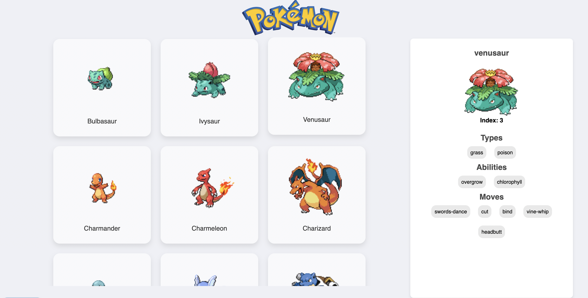

# Phase 1 Boilerplate

# 

This Pokedex application displays information about Pokemon using the Pokemon API. The application is built with React, utilizing tanstack/react-query for efficient data fetching and state management. Superagent is used to retrieve data from the API.

# Technologies Used:
* React
* tanstack/react-query
* Superagent
* CSS
* TypeScript

##

